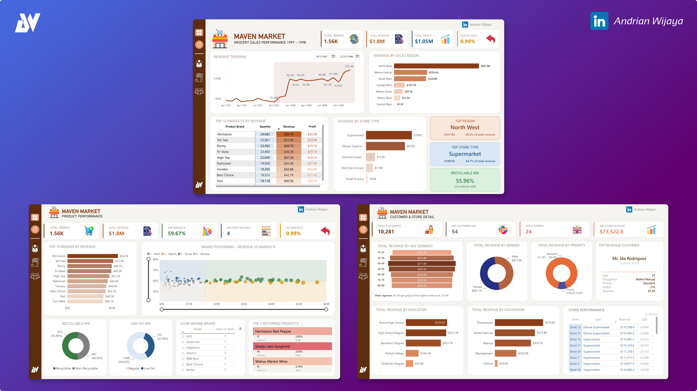
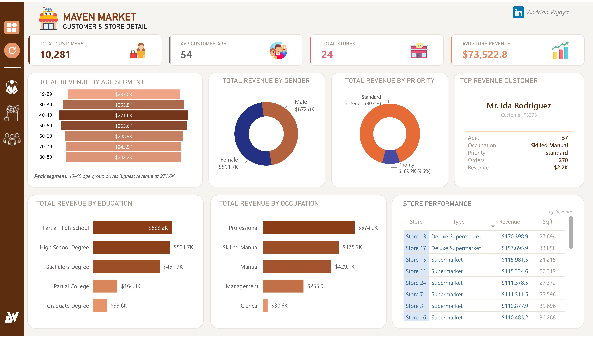

# AdventureWorksCompany-PowerBI-Dashboard 

## Introduction
Maven Market operates 24 grocery stores across Canada, United States, and Mexico, serving over 10,000 customers with a catalog of 111 product brands. Maven Market operated across 24 stores serving 10,281 unique customers throughout the 1997–1998 period. 

This analysis covers three dimensions of business performance overall sales health, product portfolio efficiency, and customer and store behavior 
drawing from the Executive Summary, Product Performance, and Customer & Store Detail dashboards.

> [!IMPORTANT]
**Data Cutoff:**
Data ends on **December 31st, 1998**

---

## Table of Content
📁 1. [Problem Statement](#1-problem-statement)  

📁 2. [Skills Demonstrated](#2-skills-demonstrated)  

📁 3. [Data Sourcing](#3-data-sourcing)  

📁 4. [Data Transformation](#4-data-transformation)  

📁 5. [Data Modeling](#5-data-modeling)  

📁 6. [Data Visualization](#6-data-visualization)

📁 7. [Data Analysis](#7-data-analysis)  

📁 8. [Conclusions](#8-conclusions)  

📁 9. [Recommendations](#9-recommendations)  

---
## 1. Problem Statement
As the business completes its second year of operations, management needs clarity on three core questions:

1. Is Maven Market financially healthy and sustainable in terms of profitability and returns?
2. Is revenue growth consistent or dependent on specific periods?
3. Is revenue and profitability concentrated in a small set of brands or evenly distributed?
4. Is the product portfolio aligned with modern consumer preferences?
5. Is revenue geographically balanced or overly concentrated?
6. Do store formats perform consistently across the portfolio?
7. Is the loyalty program effective in driving premium customer conversion?
8. Which store formats should be prioritized for expansion?
   
---

## 2. **Skills Demonstrated**
- **Data Transformation** - converting raw, unstructured data from multiple sources into a clean, standardized format
- **Data Modeling** - star schema design with fact and dimension tables
- **Data Visualization** - creating KPI cards, gauge charts, line charts, donut charts, and matrix tables
- **Data Analysis** - discover actionable insights, support critical decision-making, and validate hypotheses

---

## 3. **Data Sourcing**
The dataset is based on the AdventureWorks sample database provided by Microsoft. It consists of 8 tables:

| Table | Description |
|---|---|
| Transaction | Transaction-level fact table |
| Return | Return transaction-level fact table |
| Customer Lookup | Customer demographics and attributes |
| Product Lookup | Product names, categories, and pricing |
| Stores Lookup | Stores type, address, and area |
| Regions Lookup | Sales region and continent |
| Calendar Lookup | Date dimension table |
| Product Brand Lookup | Brand average in shelf, performance zone, and margin brand |

---

## 4. **Data Transformation**  
Data was **cleaned** and transformed using Power Query (M Language):
- Standardized tables name
  - 
- Appending transaction table
  - 
- Removing duplicate, null, or error rows from all Data
  - 
- Replacing values
  - 
- Standardized date formats across all tables and creating column for every date element
  - 
- Creating calculated column
  - 
  - 
- Defining key column
  - 
    --- 
- Customing calculation (DAX Measure)
  - Data Analysis Expression that used in this project
    - 

  - Additional DAX for the highlight revenue trending
    - 

---

## 5. **Data Modeling**

- **Fact Table**: Sales Data (transactions), Return Data (transaction)
- **Dimension Tables**: Customer, Product, Territory, Calendar, Category Product, and Subcategory Product
- All relationships are **single-direction** (one-to-many)
- A dedicated **measure table** (`Measures`) stores all DAX calculations separately from raw data tables
- No bi-directional relationships to maintain query performance
- Unrelated table: there are measure table (for grouping DAX calculation), transaction 1997 & 1998 (unused table, use only for appending table, 
date slicer (for slicer in highlight revenue trending), target parameter and trendline selection (use for brand positioning in product performance)

---

## 6. **Data Visualization**  

The dashboard consists of 3 report pages:
- **Executive Summary**
  ---
  - 
- **Product Performance**
  ---
  - 
- **Customer & Store Detail**
  ---
  - 

---

## 7. Data Analysis

### A. Business Performance

Maven Market recorded 1,560 total orders generating $1.8M in total revenue and $1.05M in total profit, representing a profit 
margin of 58.3% an exceptionally healthy profitability ratio for a grocery retail operation. 

The business retains $0.58 of every $1.00 sold, confirming strong pricing power and cost discipline across the portfolio. 
A return rate of 0.99% below the 1% threshold further validates product quality consistency, 
indicating that less than 1 in 100 items purchased is returned across the entire catalog.

---

### B. Product Performance

**Revenue & Brand**
Hermanos leads all brands at $56.7K in revenue, with the top 10 brands clustering tightly between $40K and $57K a 
competitive mid-tier with no single dominant outlier. The average margin of 59.67% is consistent across all top brands,
confirming volume and profitability are aligned. However, a cluster of slow-moving brands averages 7 days on shelf 75%
slower than the 4-day portfolio average and the top 3 returned products all exceed the portfolio return rate by 3x.

---

### C. Store Performance

North West dominates at $847.8K - 48% of total revenue creating a significant concentration risk. Mexico collectively
contributes $479K across three regions, making it the second largest market but without a unified strategy. Central West
at $9.3K is effectively non-operational. Deluxe Supermarket consistently delivers the highest revenue per store, while 
Small Grocery contributes only 1.9% of total revenue.

### D. Customer Profile

Maven Market serves 10,281 customers with an average age of 54 years. Revenue is evenly distributed across all age groups
and near-equally split by gender confirming broad demographic appeal (peak segment 40-49 years old). However, 90.4% of revenue comes from Standard-priority
customers, revealing a critical loyalty program gap. The top customer generates only $2.2K from 270 orders at $8.15 per
transaction a high-frequency, low-basket profile that reflects a broadly distributed rather than premium-driven
revenue structure.

---

## 8. Conclusions

Maven Market is a profitable and growing business with strong fundamentals 58.3% profit margin, sub-1% return rate, and
110% revenue growth year-over-year. However, three structural challenges require attention to sustain this momentum:

**1. Geographic concentration**
48% of revenue depends on North West alone. Expanding Mexico as a unified market and activating underperforming regions
like Canada West will reduce risk and unlock new growth.

**2. Loyalty program underutilization**
With 90.4% of customers on Standard priority and a top customer averaging only $8.15 per transaction, Maven Market is leaving
premium revenue on the table. A tiered loyalty program targeting frequent buyers for upgrade to Priority or Golden membership
could materially increase average basket size.

**3. Product & store portfolio optimization**
Slow-moving brands at 7 days on shelf, Small Grocery stores contributing only 1.9% of revenue, and Store 5 at $4.9K all
represent drag on overall performance. Discontinuing underperforming products, converting Small Grocery locations
to Deluxe Supermarket format, and addressing the 34.8x store revenue gap would meaningfully improve portfolio efficiency.

---

## 9. Recommendations

### 1) Reduce Geographic Concentration Risk
**Problem:** North West contributes 48% of total revenue nearly half the business depends on a single region. 
Central West generates only $9.3K and is effectively non-operational.

**Recommendation:**
- Develop a **unified Mexico market strategy** combining Mexico Central ($330.4K), Mexico South ($87.3K), and Mexico West ($61.3K) under one regional management
  structure the combined $479K makes it the second-largest market and warrants dedicated investment
- Investigate **Canada West underperformance** at $107.7K audit store locations, product mix, and pricing alignment with Canadian consumer preferences
- Conduct an **immediate review of Central West** determine whether the single store in this region has a viable path to growth or should be reallocated to a stronger market
- Set a target to reduce North West revenue dependency from 48% to below 35% within 2 years through regional expansion

---

### 2) Upgrade Loyalty Program — Convert Standard to Priority
**Problem:** 90.4% of revenue comes from Standard-priority customers. The top individual customer averages only $8.15 per transaction — high frequency but low basket size.

**Recommendation:**
- Launch a **tiered loyalty upgrade campaign** targeting Standard customers with 50+ orders offer them Bronze or Silver membership with tangible benefits (exclusive discounts, early access to new products, priority checkout)
- Introduce a **minimum basket incentive** reward customers who exceed a basket threshold (e.g. $15 per transaction) with points or discounts to shift behavior from low-basket frequent visits to higher-value transactions
- Target **Golden membership conversion** for customers like Mr. Ida Rodriguez who have demonstrated long-term loyalty through 270+ orders personalized outreach with exclusive offers would be highly effective for this segment
- Benchmark: converting just 10% of Standard customers to Priority tier even at a modest 20% higher spend could add an estimated $32K+ in incremental annual revenue

---

### 3) Optimize Product Portfolio
**Problem:** Slow-moving brands average 7 days on shelf (75% slower than average). Top 3 returned products exceed portfolio return rate by 3x. 55.96% of products are non-recyclable.

**Recommendation:**
- **Discontinue or promote slow movers** brands averaging 7+ days on shelf (ADJ, American, Applause, Atomic, BBB Best) should be given a 90-day promotional window before removal. Freeing shelf space for faster-moving brands improves inventory turnover and reduces holding costs
- **Quality review for top returned products**, Hermanos Red Pepper (2.83%), Shady Lake Spaghetti (2.93%), and Walrus Merlot Wine (2.79%) all require supplier quality audits. For Hermanos specifically, a return rate 3x above portfolio average threatens the equity of the #1 revenue brand
- **Increase recyclable product mix** from 44.04% toward 55%+ over the next product catalog cycle prioritize Zone 1 (Best) brands that are also recyclable as the ideal product
  profile for marketing and shelf prioritization
- **Protect Zone 1 brands** (High Revenue + High Margin) ensure consistent stock availability and prioritize shelf placement for Hermanos, Tell Tale, and Ebony as the core revenue engine

---

### 4) Expand Deluxe Supermarket — Phase Out Small Grocery
**Problem:** Small Grocery contributes only 1.9% of total revenue ($34K). Deluxe Supermarket generates the highest revenue per sqft. Store 5 generates only $4.9K a 34.8x gap vs the top store.

**Recommendation:**
- **Convert Small Grocery locations to Deluxe Supermarket format** where real estate and catchment area permits Store 13 (Deluxe, $170.4K) and Store 17 (Deluxe, $157.7K) demonstrate that this format can deliver 5x+ the revenue of a Small Grocery location
- **Conduct an urgent operational audit of Store 5** at $4.9K determine whether the issue is location, management, product mix, or customer awareness. If no viable recovery path exists within 6 months, consider closure or relocation
- **Standardize the 11 below-average stores** by implementing best practices from the top-performing Deluxe Supermarket stores including product assortment, shelf layout, promotional cadence, and staff training
- **Prioritize Deluxe Supermarket for all new store openings** the format consistently delivers the highest revenue per sqft across the portfolio and should be the default expansion vehicle

---

### 5) Capitalize on Seasonal Demand
**Problem:** Revenue peaked in December 1998 at $120.16K significantly above the mid-year plateau of $92–101K. Tell Tale generated 87.5% of its annual revenue in December.

**Recommendation:**
- **Build a formal Q4 seasonal strategy**, the December peak is not accidental. Develop dedicated holiday promotions, seasonal product bundles, and increased inventory
  pre-positioning starting October each year to capture maximum seasonal demand
- **Leverage Tell Tale as a seasonal anchor brand**, its December concentration makes it a natural hero product for holiday campaigns. Bundle it with year-round performers like Hermanos to drive cross-sell revenue
- **Address the mid-year plateau** ($92–101K from March to October 1998) with targeted mid-year promotions a loyalty double-points event or seasonal product launch in May–June could break the ceiling and create a second revenue peak during the year

---

### 6) Target High-Value Customer Segments
**Problem:** Clerical occupation at $30.6K is severely underrepresented. Graduate Degree holders contribute only $93.6K. Professional segment already dominates at 31.9%.

**Recommendation:**
- **Protect and deepen the Professional segment** at 31.9% of revenue it is the single most valuable occupation group. Ensure product assortment, store experience, and loyalty
  rewards are aligned with the preferences of this segment
- **Investigate the Clerical segment gap** $30.6K from Clerical workers is disproportionately low. This may reflect a pricing accessibility issue. Consider value bundles or entry-level loyalty incentives specifically designed for lower-income occupation segments
- **Test premium product lines for Graduate Degree customers** this segment is currently underrepresented at $93.6K but likely has higher disposable income. Introducing premium or organic product ranges in high-education catchment areas could unlock a new revenue tier
- **Maintain accessible pricing for core working-class base** Partial High School ($533.2K) and High School Degree ($521.7K) customers are the revenue backbone. Any pricing or positioning shift toward premium must not alienate this core segment

---

## Priority Action Summary

| Priority | Action | Expected Impact |
|---|---|---|
| 🔴 Immediate | Audit Store 5 ($4.9K) | Recover or reallocate |
| 🔴 Immediate | Quality review — top 3 returned products | Protect brand equity |
| 🔴 Immediate | Review Central West ($9.3K) | Recover or exit |
| 🟡 Short-term | Launch loyalty upgrade campaign | Increase avg basket size |
| 🟡 Short-term | Promote or remove 7-day slow movers | Improve shelf velocity |
| 🟡 Short-term | Build Q4 seasonal strategy | Maximize December peak |
| 🟢 Medium-term | Convert Small Grocery to Deluxe format | Higher revenue per sqft |
| 🟢 Medium-term | Unify Mexico regional strategy | Unlock $479K market |
| 🟢 Medium-term | Increase recyclable product mix to 55%+ | Sustainability positioning |
| 🟢 Long-term | Reduce North West dependency to <35% | Geographic risk reduction |

---

### Repository Contents
 - Power BI Dashboard File: The main PBIX File [Maven Market](Maven_Market) containing the analysis and visualizations.
 - Data Sources: [Raw Dataset](raw_data) used in the project.
 - Screenshots/Reports: [Exported visualizations](asset) for sharing insights.
 - README.md: Project documentation (this file)

---

_Source of Dataset: Maven Analytics_
